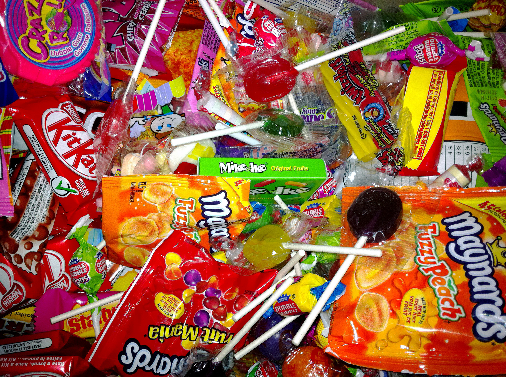
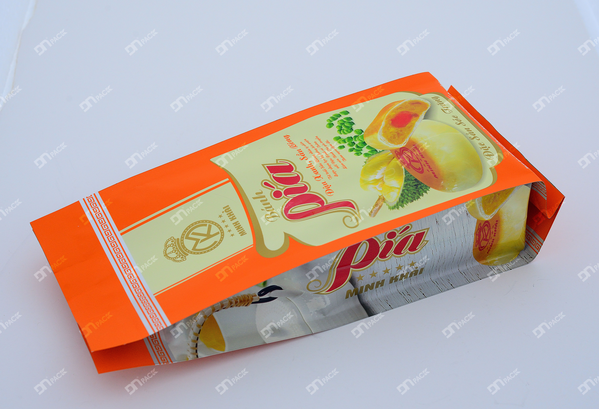

Bánh kẹo là nhóm sản phẩm thực phẩm được ưa chuộng và tiêu thụ nhanh nhất trên thị trường, đáp ứng nhu cầu của mọi lứa tuổi và tầng lớp xã hội. Trong bối cảnh cạnh tranh gay gắt hiện nay, bao bì không chỉ đơn thuần là vỏ bọc bảo vệ sản phẩm mà còn đóng vai trò then chốt trong việc:

- Quảng bá hình ảnh và thu hút người tiêu dùng
- Tăng giá trị cảm nhận của sản phẩm
- Tạo dấu ấn nhận diện thương hiệu
- Giúp doanh nghiệp dễ dàng tiếp cận và chiếm lĩnh thị trường

### 1. Bao bì tiếp xúc trực tiếp với sản phẩm

Bao bì nhựa mềm (flexible packaging) là loại bao bì phổ biến nhất trong ngành bánh kẹo, thường là lớp tiếp xúc trực tiếp với sản phẩm trước khi đưa ra thị trường. Bài viết này sẽ tập trung phân tích vai trò, cấu trúc và chức năng của bao bì nhựa mềm trong đóng gói bánh kẹo.

Ngoài bao bì nhựa mềm, bánh kẹo còn sử dụng nhiều loại bao bì khác như hộp giấy, hộp carton, túi giấy kraft... Quý khách hàng có thể tham khảo thêm các giải pháp bao bì đa dạng **[tại đây](https://www.baobiduynhat.com.vn/bao-bi-nhua)**.

### 2. Cấu trúc và thành phần bao bì bánh kẹo

**Đặc tính cần bảo vệ của bánh kẹo**

Sản phẩm bánh kẹo có những đặc điểm chung cần được bảo vệ đặc biệt:

- **Kết cấu**: Giòn, xốp, dễ bị biến dạng khi va đập
- **Hóa học**: Dễ bị oxy hóa khi tiếp xúc với không khí
- **Độ ẩm**: Nhạy cảm với độ ẩm cao, dễ bị mềm, mốc
- **Ánh sáng**: Bị ảnh hưởng bởi tia UV, làm giảm chất lượng
- **Nhiệt độ**: Cần kiểm soát nhiệt độ bảo quản phù hợp
- **Hạn sử dụng**: Thường có thời hạn trung bình đến ngắn

**Cấu trúc màng đa lớp phổ biến**

Do đặc tính đa dạng của từng loại bánh kẹo, cấu trúc bao bì cũng được thiết kế linh hoạt để đáp ứng yêu cầu bảo quản cụ thể. Dưới đây là các cấu trúc màng phổ biến:

**Cấu trúc cơ bản (cho bánh kẹo thông thường)**
- **PET/PE**: Độ bền cơ học tốt, chống ẩm cơ bản
- **OPP/PE**: Trong suốt, bóng đẹp, phù hợp hiển thị sản phẩm
- **BOPP/CPP**: Chi phí hợp lý, bảo quản tốt

**Cấu trúc nâng cao (cho bánh cao cấp, yêu cầu bảo quản cao)**
- **PET/MPET/PE**: Chống ánh sáng, chống oxy hóa tốt
- **PET/AL/PE**: Chống ánh sáng tuyệt đối, giữ hương vị lâu dài
- **PET/PA/PE**: Độ bền cơ học cao, chống thủng tốt
- **OPP/AL/PE**: Kết hợp tính thẩm mỹ và khả năng bảo quản

**Ví dụ thực tế: Bao bì bánh Pía**

Bánh Pía là sản phẩm có yêu cầu bảo quản cao với những thách thức:
- Dễ bị oxy hóa làm bánh ôi
- Nhạy cảm với độ ẩm
- Cần giữ mùi thơm đặc trưng
- Dễ bị biến dạng khi vận chuyển

**Giải pháp bao bì phù hợp:**
- **PET/PE**: Cho sản phẩm có thời hạn ngắn, phân phối nhanh
- **PET/MPET/PE**: Tối ưu cho bảo quản trung hạn, giữ màu và mùi tốt
- **PET/AL/PE**: Cho sản phẩm cao cấp, xuất khẩu, bảo quản lâu dài

**Tư vấn lựa chọn cấu trúc phù hợp**

Việc lựa chọn cấu trúc bao bì phù hợp phụ thuộc vào nhiều yếu tố:
- Đặc tính cụ thể của sản phẩm
- Thời hạn sử dụng mong muốn
- Điều kiện vận chuyển và bảo quản
- Định vị thương hiệu và giá thành sản phẩm
- Yêu cầu về thẩm mỹ và marketing

Nếu bạn còn băn khoăn về cấu trúc bao bì phù hợp cho sản phẩm của mình, hãy liên hệ với chúng tôi để được đội ngũ chuyên gia tư vấn chi tiết và chọn ra giải pháp tối ưu nhất.

### 3. Chức năng của bao bì bánh kẹo

**Bảo vệ và bảo quản sản phẩm**

Bao bì tạo ra lớp rào cản bảo vệ sản phẩm khỏi các yếu tố có hại:

- **Chống ẩm**: Ngăn hơi nước xâm nhập làm bánh mềm, mất độ giòn
- **Chống oxy**: Hạn chế quá trình oxy hóa, giữ màu sắc và hương vị
- **Chống ánh sáng**: Bảo vệ khỏi tia UV gây hư hỏng dinh dưỡng
- **Chống vi sinh vật**: Đảm bảo vệ sinh an toàn thực phẩm
- **Chống va đập**: Bảo vệ cấu trúc bánh không bị vỡ, nát trong vận chuyển

Nhờ đó, sản phẩm bánh kẹo được bảo quản lâu dài, giữ nguyên chất lượng, cảm quan tốt nhất từ nhà máy đến tay người tiêu dùng.

**Công cụ Marketing và xây dựng thương hiệu**

Bao bì là điểm chạm đầu tiên giữa sản phẩm và khách hàng, đóng vai trò quan trọng trong:

- **Nhận diện thương hiệu**: Logo, màu sắc, phong cách thiết kế đặc trưng giúp khách hàng dễ dàng nhận biết và ghi nhớ
- **Truyền tải thông điệp**: Câu chuyện thương hiệu, giá trị cốt lõi, cam kết chất lượng
- **Tạo ấn tượng đầu tiên**: Thiết kế bắt mắt thu hút sự chú ý trên kệ hàng đông đúc
- **Định vị sản phẩm**: Phân biệt rõ ràng với đối thủ cạnh tranh
- **Tạo lòng tin**: Bao bì chuyên nghiệp thể hiện sự đầu tư và chất lượng sản phẩm

**Tăng giá trị sản phẩm**

Một thiết kế bao bì xuất sắc có thể:

- **Nâng cao giá trị cảm nhận**: Khách hàng sẵn sàng trả giá cao hơn cho sản phẩm có bao bì đẹp
- **Tạo lợi thế cạnh tranh**: Nổi bật giữa hàng trăm sản phẩm cùng loại trên thị trường
- **Tăng trải nghiệm người dùng**: Bao bì tiện lợi, dễ sử dụng, dễ bảo quản sau khi mở
- **Khuyến khích mua lặp lại**: Trải nghiệm tích cực với bao bì tạo ấn tượng lâu dài
- **Mở rộng ứng dụng**: Bao bì đẹp có thể tái sử dụng, tăng giá trị thực tế

### Kết luận

Bao bì bánh kẹo không chỉ đơn thuần là vật chứa đựng sản phẩm mà là yếu tố chiến lược quan trọng quyết định thành công trên thị trường. Một giải pháp bao bì tối ưu cần cân bằng giữa chức năng bảo vệ, tính thẩm mỹ và chi phí hợp lý.

Bao Bì Duy Nhất với hơn 18 năm kinh nghiệm trong sản xuất bao bì thực phẩm, đặc biệt là bao bì bánh kẹo, cam kết đồng hành cùng doanh nghiệp tạo ra những giải pháp bao bì hoàn hảo, giúp sản phẩm của bạn tỏa sáng trên thị trường.

### Liên hệ tư vấn

Quý khách hàng cần tư vấn thêm về sản phẩm và dịch vụ, vui lòng liên hệ:

- **Hotline**: +84 2993 612 772
- **Email**: sales@baobiduynhat.com.vn
- **Website**: https://www.baobiduynhat.com.vn

Duy Nhật luôn đồng hành cùng doanh nghiệp, tăng thêm giá trị cho sản phẩm của bạn.