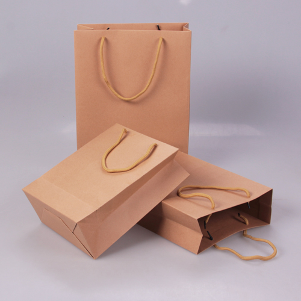

## 1.	Xu hướng thị trường
Theo xu hướng thân thiện và tích cực với môi trường, bao bì tái chế ngày càng được sử dụng phổ biến rộng rãi dần thay thổi thói quen của người sử dụng, thay thế dần các vật liệu làm từ nhựa gây ảnh hưởng xấu đến môi trường. Ngoài ra, một số quốc gia và khu vực đã có tiến trình thay thế dần bao bì sản phẩm làm từ nhựa sang thành các vật liệu thân thiện hơn với môi trường, đơn cử là: EU, Mỹ,…Do vậy, để đáp ứng các tiêu chí bao bì đối với các sản phẩm xuất khẩu nói riêng và nhu cầu sử dụng của khách hàng nói chung, các doanh nghiệp nên lựa chọn như thế nào trước xu thế trên?
## 2.	Bao bì thân thiện với môi trường
Không chỉ góp phần bảo vệ môi trường, việc sử dụng bao bì tái chế còn giúp các công ty, doanh nghiệp, cơ sở sản xuất tạo thiện cảm với người tiêu dùng, hỗ trợ quảng bá thương hiệu và tăng doanh thu cho sản phẩm. Bao bì tái chế có 02 loại hiện đang phổ biến nhất hiện nay là bao bì tái chế bằng giấy và bao bì nhựa tái chế. Mỗi loại sẽ có những đặc điểm riêng. Để biết nên chọn loại bao bì nào chúng ta cùng điểm qua những ưu nhược điểm của từng loại bao bì.
### 2.1	Bao bì giấy tái chế
Bao bì giấy tái chế được xem là giải pháp giúp giảm thiểu việc sử dụng gỗ, giảm lượng CO2 thải ra và điều quan trọng là chúng hoàn toàn phân hủy khi thải ra môi trường. Mặt khác chi phí sản xuất túi giấy tái khá thấp, quy trình in khá đơn giản nên giá thành túi giấy thường rẻ. Chất liệu làm bao bì giấy tái chế phổ biến là từ giấy kraft. 

Dưới đây là những ưu nhược điểm cơ bản của bao bì giấy tái chế dưới góc độ lợi ích cho công ty/doanh nghiệp, bạn có thể tham khảo:

**Về ưu điểm:**
*	Giá thành khá phải chăng
*	Có thể chứa đựng được đa dạng hàng hóa
*	Độ dai bền khá tốt, trọng lượng khá nhẹ
*	In ấn hỗ trợ quảng bá sản phẩm, thương hiệu
Tuy nhiên bao bì giấy tái chế chỉ phù hợp với một số mặt hàng nhất định. Nhiều nhà sản xuất không “ưu ái” lắm bao bì giấy tái chế vì về cơ bản chất liệu giấy không đáp ứng được các yêu cầu cần thiết như:
*	Độ bền thấp, dễ hư hỏng, rách dưới tác động cơ học
*	Dễ bị hỏng, ẩm, mốc do hơi nước, hoặc thấm nước
*	Không phù hợp với một số loại hàng hóa, sản phẩm dạng chất lỏng hay keo
*	Không bền khi vận chuyển đường xa
*	Khó in ấn được nhiều màu sắc theo yêu cầu, màu sắc khá đơn lẻ, không phối
### 2.2	Bao bì nhựa tái chế
Loại bao bì tái chế thứ 2 là bao bì nhựa. Túi nhựa tái chế được sản xuất từ nguồn nguyên liệu nhựa đã qua sử dụng. Điều đáng lưu ý là không phải loại nhựa nào cũng có thể tái chế. Chỉ những loại nhựa an toàn, nồng độ chất phụ gia thấp mới có thể tái chế. Do đó để sản xuất bao bì nhựa tái chế thì các đơn vị sản xuất rất chú trọng đến nguồn nhựa tái chế. Bù lại việc sản xuất túi nhựa tái chế khá dễ dàng.

**Về ưu điểm**:
* Túi có chất lượng cao với các đặc tính vật lý tương đương túi nhựa nguyên sinh như không thấm nước, bền, dẻo dai
* Độ bền tốt, ít hư hỏng, bảo quản sản phẩm tốt khi đi đường dài
* Sử dụng đa dạng cho nhiều lĩnh vực từ thực phẩm, dược phẩm đến may mặc, y tế…
* Khả năng đựng tốt với các mặt hàng có trọng lượng lớn
* Màu sắc in ấn nổi bật, đẹp mắt, hỗ trợ quảng bá thương hiệu tốt hơn
Đối với các doanh nghiệp có sản phẩm xuất khẩu sang thị trường các nước thì túi nhựa tái chế là tiêu chí vô cùng quan trọng. Bởi theo lời kêu gọi của Liên Hợp Quốc, nhiều quốc gia chỉ chấp nhận nhập khẩu những bao bì có thể tái chế và từ chối túi PE nguyên sinh. Để xác nhận bao bì có thể tái chế, các quốc gia sẽ dựa vào tiêu chuẩn Tái chế toàn cầu GRS để đánh giá.
Bên cạnh những ưu điểm trên thì nhược điểm của túi nhựa tái chế là khả năng phân hủy không tốt như túi giấy. Do đó để bảo vệ môi trường cần tạo ra đường vòng tuần hoàn tái chế với túi nhựa.
## 3.	Là doanh nghiệp nên chọn gì?
Với những ưu nhược điểm trên, có thể thấy bao bì nhựa tái chế vẫn được các doanh nghiệp ưu ái hơn vì sở hữu nhiều ưu điểm cần thiết, thậm chí là sẽ trở thành xu hướng chiếm lĩnh thị trường. Riêng với bao bì giấy tái chế thường sẽ phù hợp với các sản phẩm như quần áo, đồ khô…  
Vậy nên, việc lựa chọn bao bì tái nào còn tùy thuộc vào đặc tính sản phẩm, yêu cầu cũng như định hướng phát triển của từng doanh nghiệp. Tuy nhiên không thể phủ nhận rằng, dù chọn bao bì tái chế từ giấy hay nhựa thì doanh nghiệp của bạn cũng đã góp một phần không nhỏ nhằm giảm thiểu tác động đến môi trường. Đó mới là điều quan trọng.

**Bạn muốn tìm hiểu thêm về bao bì tái chế hay có nhu cầu thiết kế và sản xuất bao bì tái chê – Hãy liên hệ với chúng tôi qua SDT +84 2993 612 772! hoặc **[liên hệ chúng tôi](https://www.baobiduynhat.com.vn/lien-he)** để giải quyết thắc mắc và nhận sự hỗ trợ tận tình./**