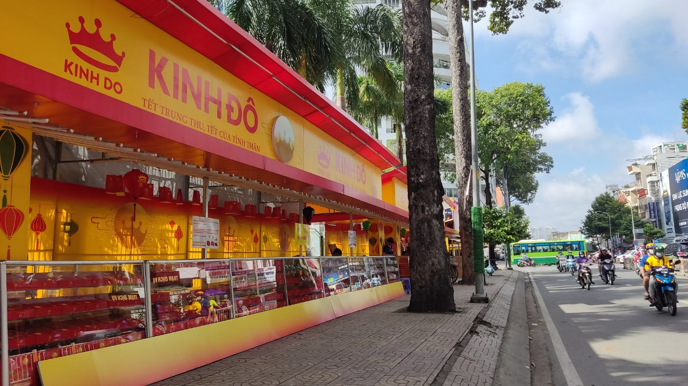

Các mặt hàng, sản phẩm bánh Trung thu năm nay được dự đoán có thể giá sẽ cao hơn mọi năm nguyên nhân là do do ảnh hưởng từ vật giá leo thang, nguyên liệu đầu vào cũng tăng giá, dẫn đến hàng loạt tình trạng khó khăn.

**Tình trạng chung của các doanh nghiệp sản xuất bánh Trung thu** 

Hiện nay trên nhiều đường phố, người dân đã bắt gặp nhiều thương hiệu bánh nổi tiếng đã bắt đầu bày bán các sản phẩm bánh trung thu. Mặc dù còn gần 2 tháng nữa mới đến dịp Trung thu, tuy nhiên nhằm mục đích thu hút khách, cũng như để bù đắp lại khoảng thời gian ảnh hưởng do dịch Covid-19 nên nhiều thương hiệu bánh Trung thu đã bày bán sớm. Trên các trang mua sắm trực tuyến như Shopee, Lazada, Tiki,.. và trang mạng xã hội, bánh trung thu các hãng, bánh trung thu handmade cũng được rao bán rầm rộ. Tuy nhiên vẫn có một thách thức lớn đối với cả doanh nghiệp sản xuất bánh Trung thu và khách hàng đó là tình trạng nhiều vật giá leo thang, cũng sẽ khiến cho giá các sản phẩm bánh trung thu sẽ tăng theo.

Đại diện các đơn vị kinh doanh cũng cho biết, năm nay giá nguyên liệu đầu vào để làm bánh đều tăng giá mạnh. Do đó, giá bánh bán ra thị trường cũng cao hơn 15-25% so với những năm trước. Đơn cử, bánh trung thu Kinh Đô năm nay dao động từ 55-390.000 đồng/chiếc. Thấp nhất là các loại bánh dẻo nhân hạt sen, đậu xanh, sầu riêng, sữa dừa có trọng lượng 180g được bán với giá 55.000 đồng/chiếc. Trong khi đó, các đơn vị kinh doanh truyền thống, nhỏ lẻ tỏ ra khá dè chừng trong việc thay đổi giá cả. Mặc dù giá bột mì, dầu ăn, đường,... dù không rơi vào tình trạng "cháy hàng" nhưng đều tăng từ 30-50% so với các năm trước. Tuy nhiên, đơn vị sản xuất chấp nhận lời ít đi và vẫn giữ mức giá như mọi năm vì e ngại mất khách khi tăng giá đột ngột.

Có thể nhận thấy, bánh Trung thu cũng không nằm ngoài cơn "bão giá" của thị trường khi kể từ đầu năm giá cả các loại hàng hóa tăng lên đáng kể. Rau củ còn tăng gấp đôi, thậm chí là gấp ba cho nên bánh Trung thu tăng giá khoảng 20% cũng là điều mà người tiêu dùng đã có thể lường trước.

**Cách mà Công ty Duy Nhật có thể giúp các doanh nghiệp đối tác**

Một trong những thành phần quan trọng góp phần tạo nên sự thành công của các loại bánh trung thu đến từ các sản phẩm bao bì. Hầu hết các sản phẩm bao bì bánh pía hay bánh trung thu đều được thiết kế bắt mắt từ kiểu dáng đến màu sắc sang trọng. Bao bì cũng đóng góp quan trọng trong sự thành công của một sản phẩm. Công ty Duy Nhật tự hào với hơn 18 năm trong việc sản xuất các loại bao bì, đặc biệt với các doanh nghiệp sản xuất bánh trung thu, đến với Duy Nhật - chúng tôi sẽ cung cấp cho các quý công ty đối tác **chất lượng sản phẩm đảm bảo, với mức giá tốt nhất,** từ đó góp phần giải quyết các vấn đề về giá mà các doanh nghiệp sản xuất bánh trung thu đang phải đối mặt.

Nếu bạn quan tâm đến việc có được giá tốt nhất cho sản phẩm bao bì của mình, vui lòng liên hệ với Bao Bì Duy Nhật qua **+84 2993 612 772** hoặc **sales@baobiduynhat.com.vn** để được tư vấn miễn phí, chúng tôi sẽ luôn tăng thêm giá trị cho nhiều sản phẩm của bạn. Ngoài ra, để biết thêm thông tin chung, vui lòng truy cập: https://www.baobiduynhat.com.vn

