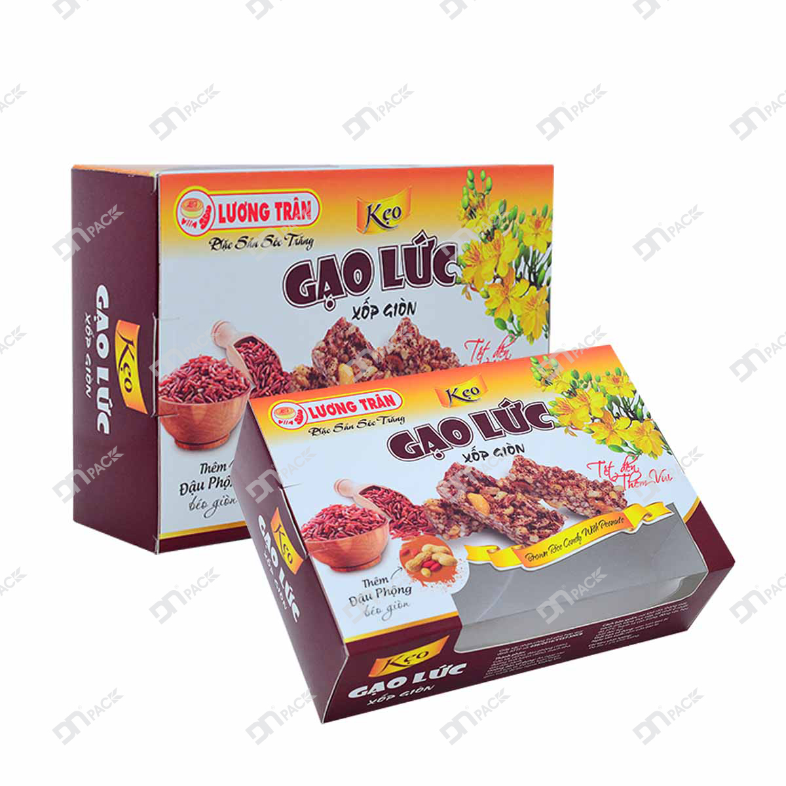
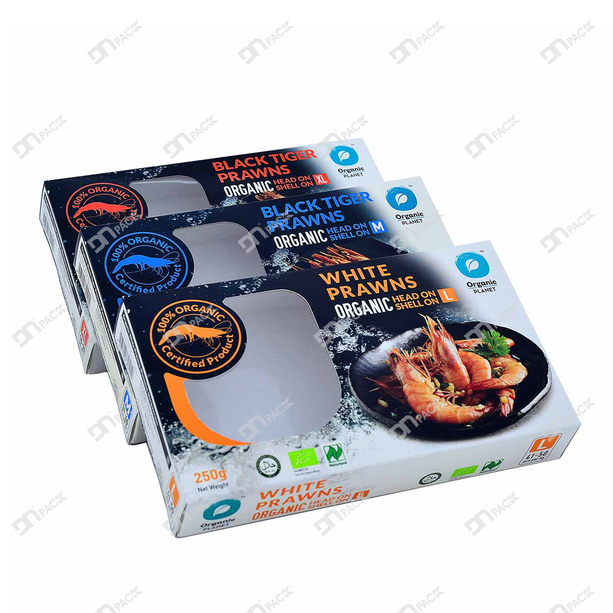
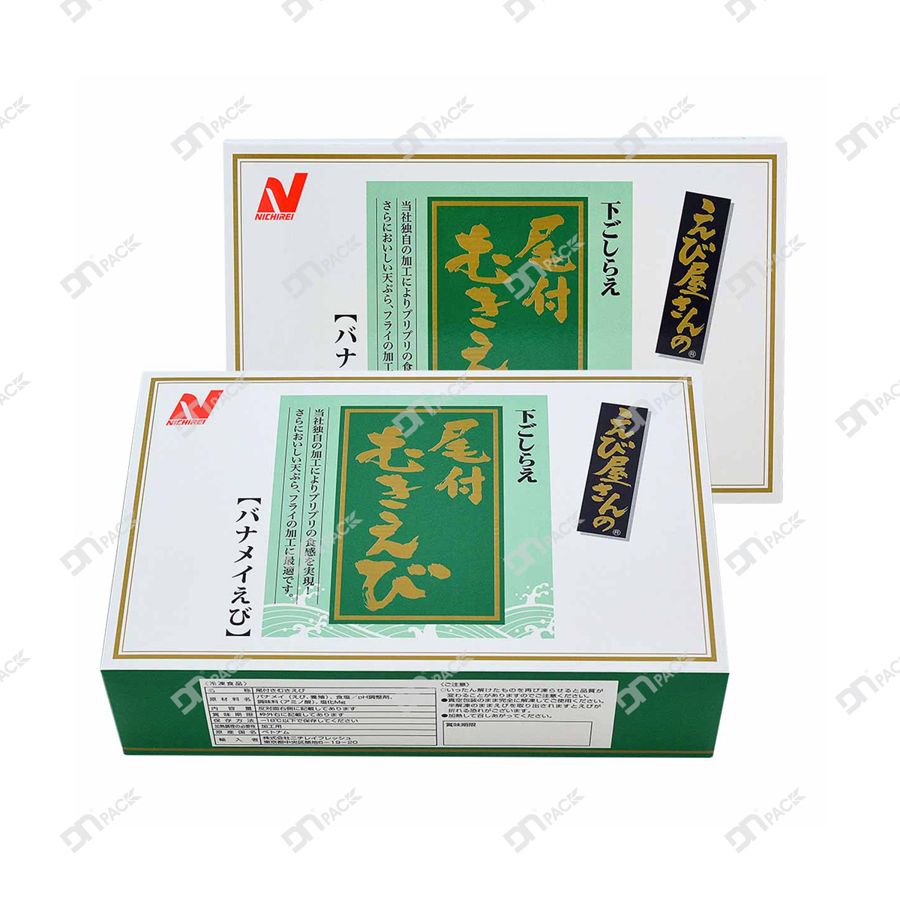

Bạn đang có ý tưởng - Bạn muốn lên thiết kế cho hộp giấy đựng sản phẩm của mình đẹp hơn, bắt mắt hơn nhưng chưa biết phải bắt đầu từ đâu. Vậy hãy đọc qua bài viết này.

***"Những điều cần lưu ý khi thiết kế hộp giấy"***

Những lưu ý quan trọng trước khi thiết kế bao bì hộp giấy bạn cần quan tâm đó là: mẫu mã sản phẩm, đối tượng khách hàng và cách thức tiếp cận khách hàng tiềm năng. Khi quyết định đưa sản phẩm ra thị trường các bạn phải giải đáp được những vấn đề trên. Hãy dành chút ít thời gian để cùng tìm hiểu và đưa ra quyết định cho mẫu mã bao bì cho sản phẩm của bạn một cách tối ưu nhất.

**1. Mẫu mã sản phẩm**

Đầu tiên bạn phải xác định sản phẩm bạn đang kinh doanh là gì? Thực phẩm, mỹ phẩm, áo quần, giày dép… hay các mặt hàng tiện dụng. Kích thước của sản phẩm là bao nhiêu? Chất liệu sản phẩm là gì? Thực phẩm rắn, thực phẩm lỏng, thuỷ tinh, gốm sứ,…  Phương thức vận chuyển là vì? Đảm bảo cho yếu tố chịu được va chạm cơ học,…

Những yếu tố trên sẽ giúp bạn xác định được kiểu dáng bao bì cho sản phẩm của mình để có mẫu mã thiết kế vỏ hộp giấy mang đặc tính phù hợp cho từng sản phẩm. Ví dụ, sản phẩm là son, phấn… sở hữu kích thước nhỏ gọn, bao bì chỉ cần vừa đủ kích thước sản phẩm. Hàng dễ vỡ thì cần tính toán kết cấu trợ lực, đảm bảo tuyệt đối cho sản phẩm được an toàn trong quá trình vận chuyển,.…

 

**2. Đối tượng khách hàng**

Sản phẩm bạn đang kinh doanh được sử dụng cho đối tượng khách hàng có giới tính như thế nào hay dành cho tất cả mọi người. Dự đoán độ tuổi và thu nhập của khách hàng mục tiêu cho phù hợp với tầm giá sản phẩm. Đối với đối tượng khách hàng có độ tuổi trên 40 thì sử dụng Font chữ lớn, phải có kích thước lớn, dễ đọc. Đối với tầng lớp khách hàng có thu nhập cao thì sản phẩm phải mang độ tinh tế, đẳng cấp nhất định nhằm ảnh hưởng đến quyết định mua hàng. Cùng với đó bạn cũng nên tìm hiểu xem họ có đang quan tâm đến vấn đề bảo vệ môi trường hay không? Vì đây là mục tiêu lâu dài cho cộng đồng, xác định sớm vấn đề này sẽ tiết kiệm cho bạn bằng việc hạn chế được các thay đổi sau này.

**3. Thiết kế của hộp giấy mang đặc tính phát triển thương hiệu sản phẩm**

Sản phẩm thường sẽ là đại diện cho hình ảnh của nhãn hiệu. Nếu bao bì của bạn phải miêu tả được một số đặc tính nhu yếu, hãy đảm bảo rằng bạn đã thu thập toàn bộ các thông tin trước khi bắt đầu:

**3.1 Nội dung thể hiện trên hộp**

Bạn cũng cần xác định trước những thông tin cần thể hiện trên thiết kế bao bì. Tùy thuộc vào ngành nghề và sản phẩm kinh doanh, sẽ có các trường thông tin quan trọng mà bạn nên thể hiện trước khách hàng. Trong đó bao gồm đầy đủ tên sản phẩm và nhà sản xuất hoặc những trong khoảng kêu gọi hành động mua hàng.

**3.2 Hình ảnh, nội dung, thiết kế ảnh hưởng đến quyết định mua hàng của khách**

Những ký hiệu, biểu tượng tùy thuộc vào sản phẩm và lĩnh vực, bạn có thể thêm vào các đoạn barcode, thông báo dinh dưỡng, biểu trưng hợp pháp,… và các thông tin khác như: Tên sản phẩm, chức năng, Thành phần, hướng dẫn sử dụng, Nơi sản xuất, nhà cung cấp, tên và địa chỉ nhà phân phối, khối lượng tịnh, NSX, HSD…

Nghiên cứu thẩm mỹ của đối tượng khách hàng trước khi bắt tay lên ý tưởng thiết kế bao bì. Chụp hình lại khi bạn đi mua sắm tại siêu thị chẳng hạn để có thể tham khảo thêm nhiều ý tưởng cho Màu sắc, Fonts chữ, layout,... Thu thập các mẫu bao bì sản phẩm bán chạy trên thị trường để nắm được xu hướng tiêu dùng của khách hàng. Lên ý tưởng cho sản phẩm sau khi đã thực hiện các bước trên.

 

**4. Thiết kế hộp**

Bạn cũng cần xem xét tới vấn đề chất liệu giấy trước khi tiền hành Design kiểu dáng hộp.
Có những bạn tự chọn phương án tự thiết kế vỏ hộp của mình. Các bạn có thể sử dụng phần mềm design kiểu dáng hộp giấy như: coreldraw, photoshop,... Ngoài ra cũng có rất nhiều video chỉ dẫn bí quyết thiết kế kiểu dáng vỏ hộp sang trọng trên youtube. Chỉ với vài thao tác đơn giản là các bạn có thể tự phác họa sơ lược về thiết kế hộp giấy của doanh nghiệp mình.

Những bạn không quen với công việc này thì tốt nhất nên tìm tới các nhà thiết kế chuyên nghiệp hơn để đảm bảo chất lượng và phù hợp với ý tưởng của mình. Hãy đến với Bao bì Duy Nhật để được tư vấn thiết kế hoàn toàn MIỄN PHÍ 100%. Bao bì Duy Nhật là công ty chuyên in ấn, sản xuất, gia công và thiết kế các loại bao bì trong đó có bao bì hộp giấy, chúng tôi luôn mong muốn kết nối hợp tác với các doanh nghiệp trong khoảng thời gian lâu dài.

 

**Bạn muốn tìm hiểu thêm về bao bì giấy hay có nhu cầu thiết kế và sản xuất bao bì giấy – Hãy liên hệ với chúng tôi qua số điện thoại +84 2993 612 772! hoặc **[liên hệ chúng tôi](https://www.baobiduynhat.com.vn/lien-he)** để giải quyết thắc mắc và nhận sự hỗ trợ tận tình.**
