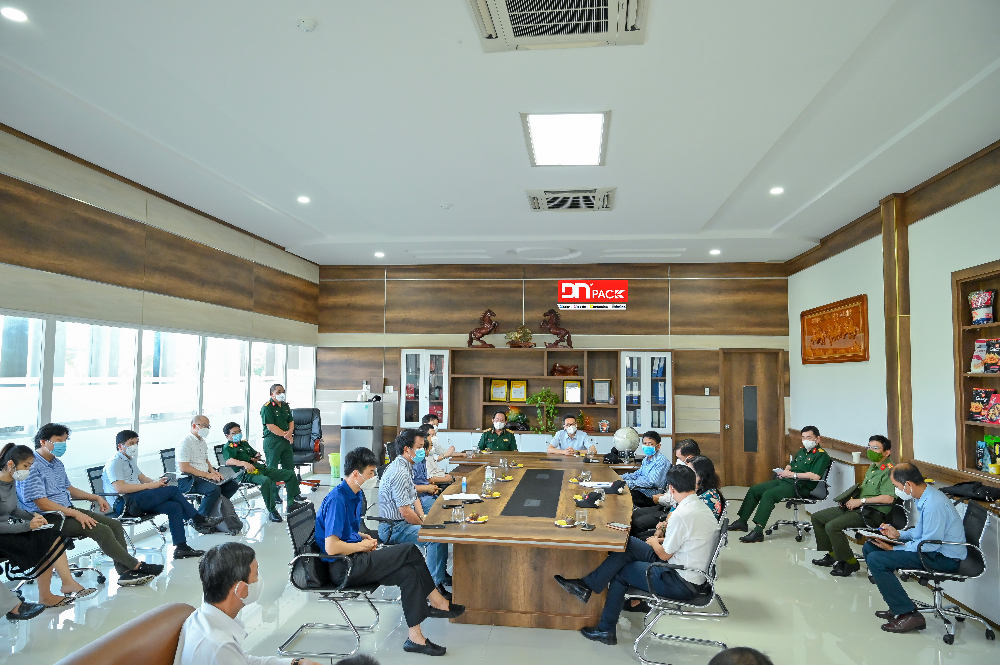
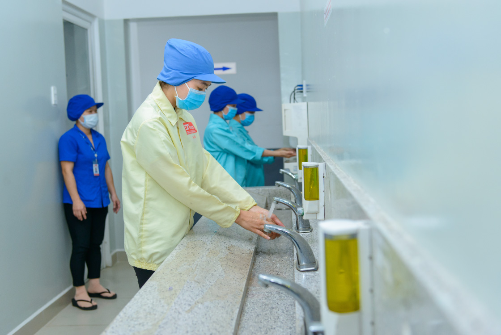
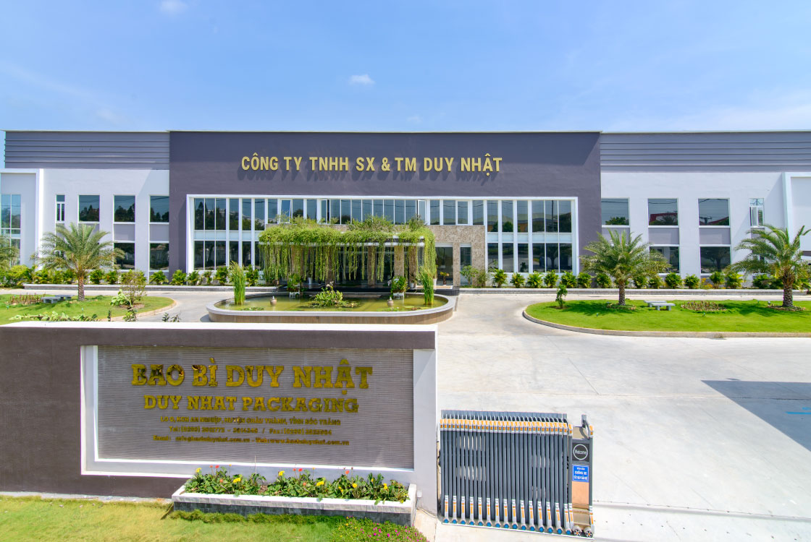

Những năm vừa qua với nhiều biến động do Covid-19 tác động xấu đến nền kinh tế. Năm 2022 dần đi qua với những khởi sắc kinh tế phát triển mạnh mẽ, trong đó nổi bật là ngành bao bì với nhiều tiềm năng phát triển.

Bức tranh ngành bao bì hiện nay là sự phân hóa theo nhóm ngành hàng và vật liệu đóng gói. Các nhóm ngành tiêu biểu như: hàng tiêu dùng, dược phẩm và các sản phẩm chăm sóc sức khỏe, thương mại điện tử, bao bì đóng gói dược phẩm, thực phẩm đóng gói, dán nhãn,... Xét theo tính chất vật liệu có các loại như: bao bì nhựa, bao bì giấy,...

Hiện nay do nhu cầu đóng gói các sản phẩm phụ trợ, phục vụ việc bán hàng online và phân phối trực tiếp cùng hoạt động xuất khẩu tăng trưởng, đặc biệt là đối với các ngành có tỷ trọng xuất khẩu cao như dệt may, da giày, thủy sản, linh kiện, thiết bị điện tử… giúp cho phân khúc giấy bao bì, hộp giấy, thùng carton có sự tăng trưởng đột phá. Ngoài ra các loại bao bì khác cũng ghi nhận sự phát triển mạnh mẽ.

Nhận định về triển vọng trong năm 2022, hơn 80% chuyên gia và doanh nghiệp trong khảo sát của Vietnam Report cho rằng, ngành bao bì sẽ duy trì tốc độ tăng trưởng với nhiều động lực thúc đẩy ngành bao bì trong thời gian tới. Mặt khác, các hiệp định thương mại tự do như: EVFTA, CPTPP, RCEP được ký kết và đi vào hiệu lực sẽ tiếp tục mở ra cơ hội xuất khẩu cho các ngành hàng sử dụng nhiều bao bì như: nông, lâm, thủy sản, công nghiệp chế biến…, cùng với nhu cầu về bao bì chất lượng cao trên thế giới rất lớn như giấy bao bì cao cấp (tráng phủ), điều đó mang lại cơ hội xuất khẩu lớn cho ngành bao bì của Việt Nam.

Tại Việt Nam, thống kê sơ bộ cho thấy bao bì đóng gói thực phẩm chiếm 30-50%; điện - điện tử chiếm 5-10%; hóa dược phẩm từ 5-10%. Sự phát triển của ngành hàng thực phẩm của Việt Nam là tác nhân thúc đẩy lĩnh vực bao bì đóng gói luôn đạt mức tăng trưởng bình quân từ 15-20%/năm, riêng bao bì nhựa đã đạt mức tăng trưởng 25%/năm và chiếm tỷ trọng doanh thu cao nhất trong cơ cấu ngành nhựa (38 - 39%). 

Dư địa tăng trưởng của ngành bao bì tại Việt Nam trong thời gian tới vẫn còn lớn. Để đón đầu cơ hội tăng trưởng thị trường, công ty Bao Bì Duy Nhật chúng tôi đã trang bị tất cả các máy móc hiện đại đạt chuẩn quốc tế. Với hệ thống quản lý chất lượng: ISO 9001:2005 và BRC cho bao bì thực phẩm. Bên cạnh đó, chúng tôi luôn không ngừng cải tiến công nghệ sản xuất làm việc với những nhà cung cấp nhựa hàng đầu nhằm hướng tới bảo vệ môi trường, làm cho sản phẩm của Bao Bì Duy Nhật luôn thân thiện với môi trường, dễ dàng tái chế, giảm thiểu lượng rác thải môi trường.

**Bạn muốn tìm hiểu thêm về ngành bao bì hay các vấn đề hợp tác – Hãy liên hệ với chúng tôi qua số điện thoại +84 2993 612 772 hoặc [liên hệ chúng tôi](https://www.baobiduynhat.com.vn/lien-he) để giải quyết thắc mắc và nhận sự hỗ trợ tận tình.**