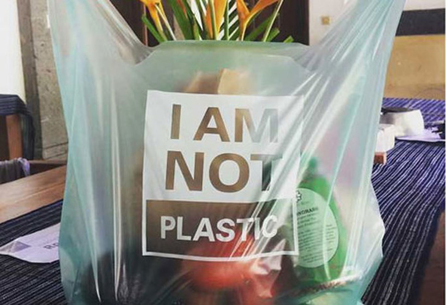
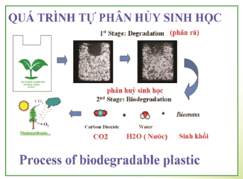

Ngày nay, việc lựa chọn "túi tự hủy sinh học" để bảo vệ môi trường và giảm thiểu rác thải nhựa ngày càng được nhiều người hưởng ứng. Tại một số quốc gia, việc sử dụng "túi tự hủy sinh học" đã trở thành một phong trào mạnh mẽ, dần thay đổi thói quen sử dụng túi nilon truyền thống.

***Vậy làm sao để hiểu đúng và hiểu đủ về loại túi này? Hay bạn đã biết gì về chúng?***

### 1. Túi tự hủy sinh học là gì?

Trên thị trường ngày nay, có nhiều loại túi được gắn mác: túi tự hủy sinh học, túi tự hủy, túi tự tiêu hủy, túi sinh học tự phân hủy, túi sinh học tự hủy, bao đựng tự hủy, túi bóng tự hủy, bao bì tự hủy sinh học, túi tự hủy thân thiện môi trường... Những loại túi này thường được quảng cáo là sẽ hạn chế tác động tiêu cực đến môi trường và có khả năng tự phân hủy.

**Vậy nó có thực sự "tự hủy" không? Có tốt cho môi trường không?**

Câu trả lời là **KHÔNG**. **KHÔNG** có loại túi nào có thể tự hủy được và **KHÔNG** phải cứ là túi có chứa từ "sinh học" thì có nghĩa là sẽ tốt cho môi trường.

Về bản chất, không có vật liệu nào có khả năng tự mình phân hủy. Để phân hủy được, chúng buộc phải có sự tác động từ các yếu tố ngoại cảnh như vi sinh vật, các yếu tố môi trường (nhiệt độ, độ ẩm, xúc tác) và đặc biệt là ánh sáng.

Các yếu tố này sẽ làm thay đổi cấu trúc bền vững của vật liệu và khiến chúng bị phân hủy. Do đó, nếu dùng từ "tự hủy" để đặt tên cho sản phẩm là không chính xác.

**Các khái niệm quan trọng**

Để làm rõ vấn đề này, hãy tìm hiểu ba khái niệm sau:

- **Sự phân hủy sinh học**: Là quá trình chuyển hóa các phân tử thành các chất vô cơ như CO₂, H₂O và sinh khối dưới tác động của vi sinh vật.

- **Túi sinh học**: Là túi được làm từ nguyên liệu có nguồn gốc từ tự nhiên như bột ngô, khoai, sắn... Loại túi này có thể phân hủy sinh học hoặc không. Các loại túi sinh học không phân hủy sinh học về bản chất không hề khác với túi nilon truyền thống.

- **Túi phân hủy sinh học**: Là loại túi được làm từ nguyên liệu gốc tự nhiên như PLA, PHA hoặc gốc dầu mỏ như PBS, PCL, PBAT... Tuy nhiên, chúng có khả năng phân hủy sinh học thành CO₂, H₂O và sinh khối chỉ trong thời gian ngắn.

Khác với túi nilon truyền thống, túi sinh học được làm từ nguyên liệu có nguồn gốc tự nhiên như tinh bột ngô, khoai, sắn... Nguồn nguyên liệu này có khả năng tái tạo nên sẽ giảm bớt việc phụ thuộc vào nguồn hóa thạch đang cạn kiệt dần.

**Phân loại túi sinh học**

Dựa vào khả năng phân hủy sinh học, người ta chia túi sinh học thành hai loại:

- **Túi sinh học có khả năng phân hủy sinh học**: Túi làm từ PLA, PHA...
- **Túi sinh học không có khả năng phân hủy sinh học**: Túi làm từ biobased PE (HDPE, LDPE), PET, PP...

*Như vậy, để thật sự tốt cho môi trường, bạn hãy chú ý tìm mua những sản phẩm túi sinh học có khả năng phân hủy sinh học.*

### 2. Ưu điểm của túi sinh học phân hủy sinh học

Túi sinh học được đánh giá là có nhiều ưu điểm vượt trội hơn so với túi nilon truyền thống:

**An toàn cho sức khỏe**

Túi được làm từ nguyên liệu tự nhiên nên giúp con người giảm thiểu nguy cơ bị phơi nhiễm các chất độc hại như BPA, phthalates. Ngoài ra, để xử lý túi phân hủy sinh học hoàn toàn không cần đốt, chỉ cần chôn ủ nên không tạo ra các khí độc hại gây ung thư và dị tật bẩm sinh như dioxin, furan.

**Thân thiện với môi trường**

Túi sinh học phân hủy hoàn toàn có thể phân hủy thành các chất vô cơ và sinh khối mà không tồn dư chất độc hại nào trong môi trường. Hơn nữa, lượng sinh khối tạo ra có thể dùng để sản xuất phân sinh học bón cho cây trồng, giúp tái tạo lại hệ sinh thái xanh.

**Thời gian phân hủy nhanh chóng**

Các loại túi này trong điều kiện hợp lý sẽ có thời gian phân hủy rất ngắn, chỉ khoảng vài tháng đến một, vài năm. So với thời gian 100 – 500 năm của các loại túi nilon truyền thống thì thời gian này ngắn hơn rất nhiều.

### 3. Kinh nghiệm chọn mua túi sinh học phân hủy hoàn toàn

Để chọn mua đúng loại túi thân thiện với môi trường – túi sinh học phân hủy hoàn toàn, hãy dựa vào các tiêu chí sau:

**Cảm quan sản phẩm**

Cảm quan hay cảm nhận trực quan là kinh nghiệm đầu tiên bạn có thể lưu ý:

- **Sờ, ngửi**: Túi sinh học phân hủy sinh học thường sẽ mịn, xốp, lớp màng mỏng và không được phong phú về màu sắc. Nếu ngửi kỹ sẽ thấy có mùi của tinh bột.

- **Đốt**: Trong trường hợp bạn đã mua về nhà, có thể thử túi bằng cách đốt cháy. Nếu thấy sản phẩm dễ cháy và không có mùi lạ thì là túi sinh học phân hủy hoàn toàn. Ngược lại, nếu thấy túi bị co lại và có mùi khét thì đó là túi không phân hủy sinh học hoàn toàn.

**Đọc kỹ thông tin trên bao bì**

Trong trường hợp không thể cảm quan được sản phẩm, bạn cần đọc kỹ thông tin trên bao bì:

- **Không nên**: Không nên mua những loại túi mà trong bảng thành phần vẫn có chứa các loại nhựa không phân hủy sinh học như PP, PE, HDPE, LDPE...

- **Nên**: Trong bảng thành phần có chứa các ký hiệu như PLA, PBAT, PHA, PCL...

**Các chứng chỉ đáng tin cậy**

Nếu sản phẩm có các chứng chỉ sau đây, bạn có thể yên tâm lựa chọn:

- **TUV OK compost INDUSTRIAL**: Sản phẩm có khả năng phân hủy sinh học trong điều kiện ủ phân công nghiệp.
- **TUV OK compost HOME**: Sản phẩm có khả năng phân hủy sinh học trong điều kiện ủ phân tại nhà.
- **BPI (Biodegradable Products Institute) Compostable**: Sản phẩm có thể phân hủy an toàn trong điều kiện ủ phân công nghiệp.
- **DIN CERTCO compostable**: Sản phẩm có thể phân hủy sinh học trong điều kiện công nghiệp.
- **TUV OK biodegradable SOIL**: Sản phẩm sẽ phân hủy chỉ cần chôn dưới đất.
- **TUV OK biodegradable WATER**: Sản phẩm sẽ phân hủy trong nước.

### Kết luận

Việc hiểu đúng về túi phân hủy sinh học giúp bạn đưa ra lựa chọn thông minh, bảo vệ môi trường một cách thực sự hiệu quả. Hãy nhớ rằng không phải túi nào có chữ "sinh học" cũng thân thiện với môi trường. Luôn kiểm tra thành phần và chứng nhận trước khi mua.

### Liên hệ tư vấn

Bạn muốn tìm hiểu thêm về các giải pháp bao bì thân thiện môi trường?

- **Hotline**: +84 2993 612 772
- **Email**: sales@baobiduynhat.com.vn
- **Website**: [Liên hệ chúng tôi](https://www.baobiduynhat.com.vn/lien-he)

Bao Bì Duy Nhất cam kết cung cấp các sản phẩm bao bì bền vững, thân thiện với môi trường!