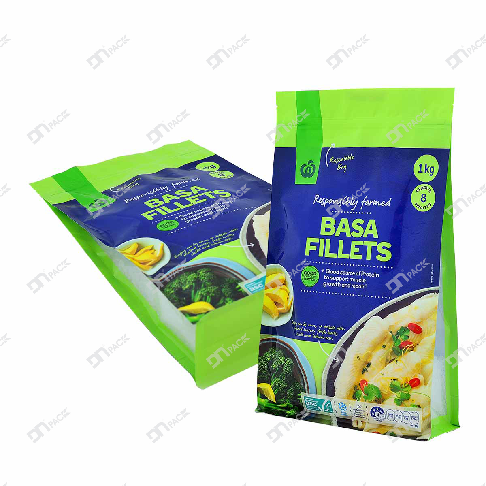

Túi Zipper hay túi Ziplock là dạng túi cao cấp, đa dạng về mẫu mã, kích thước cũng như mục đích sử dụng. Nhờ sự tiện lợi và dễ sử dụng, túi Zipper được ứng dụng phổ biến trong nhiều lĩnh vực khác nhau như thực phẩm - nông sản, phân bón, hóa mỹ phẩm, dược phẩm... Tùy thuộc vào đặc tính của sản phẩm, người tiêu dùng hoặc nhà sản xuất có thể chọn lựa mẫu mã, kiểu dáng túi Zipper phù hợp.

### 1. Túi Zipper là gì? Tại sao gọi là túi "vạn năng"?

**Túi Zipper** là loại túi nhựa cao cấp có thiết kế đặc biệt với hệ thống khóa kéo (zipper) ở miệng túi, cho phép đóng mở nhiều lần một cách dễ dàng. Điểm nổi bật của túi Zipper:

- **Đa năng**: Phù hợp với nhiều loại sản phẩm và ngành hàng khác nhau
- **Tiện lợi**: Dễ dàng mở và đóng lại, sử dụng nhiều lần
- **Bảo quản tốt**: Giữ sản phẩm tươi ngon, không bị rơi vãi
- **Thẩm mỹ**: Thiết kế đẹp mắt, nâng cao giá trị sản phẩm

Chính những ưu điểm này khiến túi Zipper được mệnh danh là "túi vạn năng" - giải pháp bao bì lý tưởng cho hầu hết các loại sản phẩm.

### 2. Phân loại túi Zipper

Do sự đa dạng trong mục đích sử dụng, việc phân loại túi Zipper cũng đa dạng không kém. Có hai cách phân loại được sử dụng phổ biến:

**Phân loại theo kiểu dáng túi**

Cách phân loại này giúp người tiêu dùng và nhà sản xuất dễ dàng nhận biết và lựa chọn chính xác:

- **Túi 3 biên gắn Zipper**: Kiểu dáng phẳng truyền thống, phù hợp với sản phẩm ít cồng kềnh
- **Túi đứng gắn Zipper**: Có đáy tự đứng, thuận tiện trưng bày trên kệ
- **Túi đứng đáy vuông (8 biên) gắn Zipper**: Đáy vuông rộng rãi, phù hợp với sản phẩm có khối lượng lớn

**Phân loại theo chất liệu túi**

Túi Zipper có chất liệu phổ biến nhất là **PA/PE** hoặc **PET/PE**. Tùy theo mục đích sử dụng, nhà sản xuất bao bì có thể thay đổi cấu trúc màng ghép để phù hợp với sản phẩm bên trong.

**Cấu trúc màng cơ bản:**
- **PA/PE**: Độ bền cơ học cao, chống thủng tốt
- **PET/PE**: Trong suốt, bóng đẹp, chi phí hợp lý

**Cấu trúc màng nâng cao:**

Đối với các sản phẩm như trà, cà phê, bánh kẹo, thuốc bảo vệ thực vật, hóa mỹ phẩm có yêu cầu cao về giữ cấu trúc, giữ màu, giữ mùi, chống hơi nước và oxy thẩm thấu, không cho ánh sáng xuyên qua, nhà sản xuất có thể ghép thêm lớp màng nhôm (AL) hoặc màng metalize (MCPP, MPET...) để tạo ra cấu trúc túi 3 lớp:

- **PA/AL/PE**: Chống ánh sáng tuyệt đối, bảo quản lâu dài
- **PET/MPET/PE**: Kết hợp thẩm mỹ và khả năng bảo quản
- **PET/AL/PE**: Cao cấp nhất, bảo quản tối ưu

### 3. Vì sao nên chọn túi Zipper?

So với các túi truyền thống, túi Zipper được xem là giải pháp bảo quản sản phẩm/thực phẩm an toàn, tiện lợi và sang trọng hơn nhiều lần, đáp ứng nhu cầu ngày càng cao về hình thức bao bì, tăng giá trị cạnh tranh cho doanh nghiệp.

**An toàn**

Túi Zipper đa số có màng ghép trong làm từ nhựa PE - loại nhựa không gây độc hại cho sức khỏe người tiêu dùng. Những ưu điểm về an toàn:

- **Không độc hại**: Lớp PE có tính "trơ" rất cao với thực phẩm, hóa mỹ phẩm, thuốc bảo vệ thực vật, không làm thay đổi tính chất sản phẩm
- **Chịu nhiệt tốt**: Có dải nhiệt rộng, khả năng chịu nhiệt cao, tác động cơ học tốt
- **Đa dụng**: Có thể sử dụng để đựng thực phẩm từ đông lạnh, khô cho đến thực phẩm nóng ở mức nhiệt độ cho phép
- **Bảo quản tốt**: Đảm bảo điều kiện bảo quản tốt về mùi và chất lượng

**Tiện lợi - Kín**

Thiết kế nổi bật của túi Zipper là có "kéo miệng" - có thể là thiết kế dán miếng hoặc khóa kéo. Điểm chung của thiết kế này là mang lại sự tiện lợi cao:

- **Sử dụng nhiều lần**: Có thể đóng mở nhiều lần, sử dụng sản phẩm dần dần
- **Không rơi vãi**: Thiết kế kín giúp bảo quản sản phẩm bên trong không bị rơi, đổ ra ngoài từ các dạng rắn, bột hay lỏng
- **Bảo vệ tốt**: Giúp thực phẩm bên trong ít bị tấn công bởi không khí, gió, bụi, vi khuẩn
- **Giữ tươi ngon**: Đảm bảo thực phẩm giữ trọn giá trị nguyên bản, hương vị khi đến tay người tiêu dùng

**Nâng cao giá trị cảm quan và tăng giá trị sản phẩm**

Túi Zipper không chỉ là bao bì mà còn là công cụ marketing hiệu quả:

- **Thiết kế chuyên nghiệp**: Nhỏ gọn, tiện lợi, chắc chắn giúp nâng cao giá trị thương hiệu
- **In ấn đẹp mắt**: Màu sắc sắc nét, hình ảnh rõ ràng hỗ trợ quảng bá thương hiệu tốt hơn
- **Tái sử dụng được**: Sau khi sử dụng, người tiêu dùng có thể tái sử dụng túi Zipper để đựng thực phẩm khác, thân thiện với môi trường
- **Ấn tượng với khách hàng**: Tạo trải nghiệm tích cực, khuyến khích mua lặp lại

### Kết luận

Túi Zipper thực sự xứng đáng với danh hiệu "túi vạn năng" với những ưu điểm vượt trội về tính an toàn, tiện lợi và thẩm mỹ. Đây là lựa chọn lý tưởng cho doanh nghiệp muốn nâng cao giá trị sản phẩm và tạo ấn tượng tốt với khách hàng.

***Hãy chọn túi gắn Zipper cho nhu cầu của bạn!***

### Liên hệ tư vấn

Quý khách hàng cần tư vấn thêm về sản phẩm và dịch vụ, vui lòng liên hệ:

- **Hotline**: +84 2993 612 772
- **Email**: sales@baobiduynhat.com.vn
- **Website**: https://www.baobiduynhat.com.vn

Duy Nhật luôn đồng hành cùng doanh nghiệp, tăng thêm giá trị cho sản phẩm của bạn.